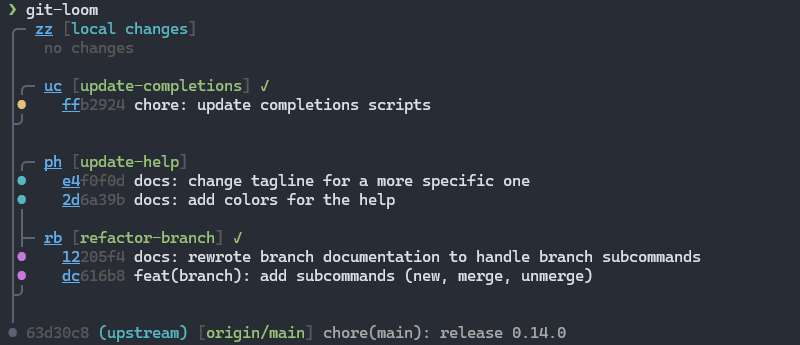

# git-loom

> Weave your branches together

**git-loom** is a Git CLI tool that makes working with integration branches seamless. Inspired by tools like [jujutsu](https://github.com/martinvonz/jj) and [Git Butler](https://gitbutler.com/), git-loom helps you work on multiple features simultaneously while keeping your branches organized and independent.



> [!IMPORTANT]
> `git-loom` has been written with the help of AI, especially [Claude](https://claude.ai/)

## What is git-loom?

git-loom introduces the concept of **integration branches** - a special branch that weaves together multiple feature branches, allowing you to:

- Work on several features at once in a single branch
- Test how features interact with each other
- Keep feature branches independent and manageable
- Easily amend, reorder, or move commits between branches
- See a clear relationship between your integration and feature branches

Think of it as a loom that weaves multiple threads (feature branches) into a single fabric (integration branch).

## Installation

### Cargo (all platforms)

```bash
cargo install git-loom
```

### Scoop (Windows)

```
scoop bucket add narnaud https://github.com/narnaud/scoop-bucket
scoop install git-loom
```

### Pre-built binaries

Download the latest archive for your platform from the [Releases](https://github.com/narnaud/git-loom/releases) page:

| Platform | Archive |
|----------|---------|
| Linux x86_64 | `git-loom-x86_64-unknown-linux-gnu.tar.gz` |
| Linux aarch64 | `git-loom-aarch64-unknown-linux-gnu.tar.gz` |
| macOS x86_64 | `git-loom-x86_64-apple-darwin.tar.gz` |
| macOS Apple Silicon | `git-loom-aarch64-apple-darwin.tar.gz` |
| Windows x86_64 | `git-loom-x86_64-pc-windows-msvc.zip` |

Extract the binary and place it somewhere on your `PATH`.

### From Source

Requires Rust 1.90 or later.

```bash
git clone https://github.com/narnaud/git-loom.git
cd git-loom
cargo install --path .
```

## Usage

```
Usage: git-loom.exe [OPTIONS] [COMMAND]

Workflow:
  init              Initialize a new integration branch
  update, up        Pull-rebase and update submodules
  push, pr          Push a branch to remote

Commits:
  commit, ci        Create a commit on a feature branch
  fold              Amend, fixup, or move commits [amend, am, fixup, mv, rub]
  absorb            Auto-distribute changes into originating commits
  split             Split a commit into two
  reword, rw        Reword a commit message or rename a branch
  drop, rm          Drop a change, commit, or branch

Branches:
  branch, br        Manage feature branches (create, merge, unmerge)

Inspection:
  status            Show the branch-aware status (default command)
  show, sh          Show commit details (like git show)
  trace             Show the latest command trace

Options:
      --no-color       Disable colored output
      --theme <THEME>  Color theme for graph output [default: auto] [possible values: auto, dark, light]
  -h, --help           Print help (see more with '--help')
  -V, --version        Print version
```

## Set Up Your Shell

### PowerShell

Add the following to your PowerShell profile (`$PROFILE`):

```powershell
Invoke-Expression (&git-loom completions powershell | Out-String)
```

### Clink

Create a file at `%LocalAppData%\clink\git-loom.lua` with:

```lua
load(io.popen('git-loom completions clink'):read("*a"))()
```

## Core Concepts

### Integration Branch

A branch that merges multiple feature branches together. This allows you to:

- Work on multiple features in a single context
- Test how features work together
- See the combined state of your work

### Feature Branches

Independent branches that are combined into the integration branch. You can manage them (reorder, amend, split) without leaving the integration context.

## Configuration

### Git Config Settings

| Setting | Values | Default | Description |
|---------|--------|---------|-------------|
| `loom.remote-type` | `github`, `azure`, `gerrit` | Auto-detected | Override the remote type for `git loom push` |
| `loom.push-remote` | Any remote name | Auto-detected | Override which remote to push to (e.g., `personal` for fork workflows) |
| `loom.hideBranchPattern` | Any prefix string | `local-` | Prefix for branches hidden from `loom status` by default |

#### `loom.remote-type`

By default, `git loom push` auto-detects the remote type:

- **GitHub** if the remote URL contains `github.com`
- **Azure DevOps** if the remote URL contains `dev.azure.com`
- **Gerrit** if `.git/hooks/commit-msg` contains "gerrit"
- **Plain Git** otherwise

You can override this with:

```bash
git config loom.remote-type github   # Force GitHub push (push + open PR)
git config loom.remote-type azure    # Force Azure DevOps push (push + open PR)
git config loom.remote-type gerrit   # Force Gerrit push (refs/for/<branch>)
```

#### `loom.push-remote`

By default, `git loom push` uses the integration branch's remote for pushing. One exception: if the integration branch tracks a remote named `upstream` and a remote named `origin` also exists, pushes go to `origin` automatically (the standard GitHub fork convention).

For non-standard fork setups where your remotes have different names, set this explicitly:

```bash
git config loom.push-remote personal
```

For example, with remotes:

- `origin` → upstream read-only repository
- `personal` → your fork (where you push)

Now `git loom push` will push to `personal` regardless of remote names.

### Environment Variables

| Variable | Description |
|----------|-------------|
| `NO_COLOR` | Disable colored output when set (follows the [NO_COLOR](https://no-color.org/) standard) |
| `TERM` | Colors are automatically disabled when `TERM=dumb` |

### CLI Flags

| Flag | Description |
|------|-------------|
| `--no-color` | Disable colored output |
| `--theme <auto\|dark\|light>` | Set the graph color theme (default: `auto`) |

## Contributing

Contributions are welcome! This project is in early development, so there's plenty of room for new ideas and improvements.

### Pre-commit Setup

This project uses [pre-commit](https://pre-commit.com/) to manage Git hooks. Install the hooks with:

```bash
pre-commit install --install-hooks
```

This ensures commit messages and code quality checks run automatically before each commit.

## License

MIT License - Copyright (c) Nicolas Arnaud-Cormos

See [LICENSE](LICENSE) file for details.

## Acknowledgments

Inspired by:

- [jujutsu](https://github.com/martinvonz/jj) - A Git-compatible VCS with powerful features for managing complex workflows
- [Git Butler](https://gitbutler.com/) - A Git client that makes working with virtual branches easy
