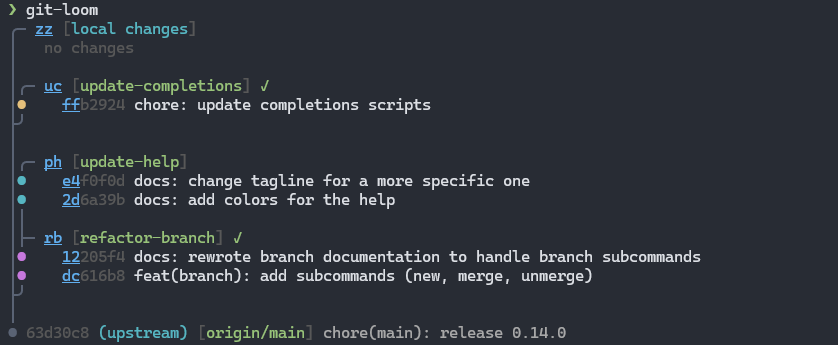

# git-loom


**git-loom** is a Git CLI tool that makes working with integration branches seamless. Inspired by tools like [jujutsu](https://github.com/martinvonz/jj) and [Git Butler](https://gitbutler.com/), git-loom helps you work on multiple features simultaneously while keeping your branches organized and independent.



> [!IMPORTANT]
> `git-loom` has been written with the help of AI, especially [Claude](https://claude.ai/)

## Documentation

Full documentation is available at **<https://narnaud.github.io/git-loom/>**

- [Shell setup](https://narnaud.github.io/git-loom/shell-setup.html) (completions for PowerShell, Clink)
- [Configuration](https://narnaud.github.io/git-loom/configuration.html) (remote type, push remote, hidden branches)

## Commands

```
Workflow:
  init              Initialize a new integration branch
  update, up        Pull-rebase and update submodules
  push, pr          Push a branch to remote

Commits:
  commit, ci        Create a commit on a feature branch
  fold              Amend, fixup, or move commits [amend, am, fixup, mv, rub]
  absorb            Auto-distribute changes into originating commits
  split             Split a commit into two
  swap              Swap two commits
  reword, rw        Reword a commit message or rename a branch
  drop, rm          Drop a change, commit, or branch

Branches:
  branch, br        Manage feature branches (create, merge, unmerge)

Inspection:
  status            Show the branch-aware status (default command)
  show, sh          Show commit details (like git show)
  diff, di          Show a diff using short IDs (like git diff)
  trace             Show the latest command trace

Recovery:
  continue, c       Resume a paused operation after resolving conflicts
  abort, a          Cancel a paused operation and restore original state
```

## Installation

```bash
cargo install git-loom
```

See the [installation guide](https://narnaud.github.io/git-loom/installation.html) for more options (Scoop, pre-built binaries, from source).

## Contributing

Contributions are welcome! This project is in early development, so there's plenty of room for new ideas and improvements.

### Pre-commit Setup

This project uses [pre-commit](https://pre-commit.com/) to manage Git hooks. Install the hooks with:

```bash
pre-commit install --install-hooks
```

This ensures commit messages and code quality checks run automatically before each commit.

## License

MIT License - Copyright (c) Nicolas Arnaud-Cormos

See [LICENSE](LICENSE) file for details.

## Acknowledgments

Inspired by:

- [jujutsu](https://github.com/martinvonz/jj) - A Git-compatible VCS with powerful features for managing complex workflows
- [Git Butler](https://gitbutler.com/) - A Git client that makes working with virtual branches easy
