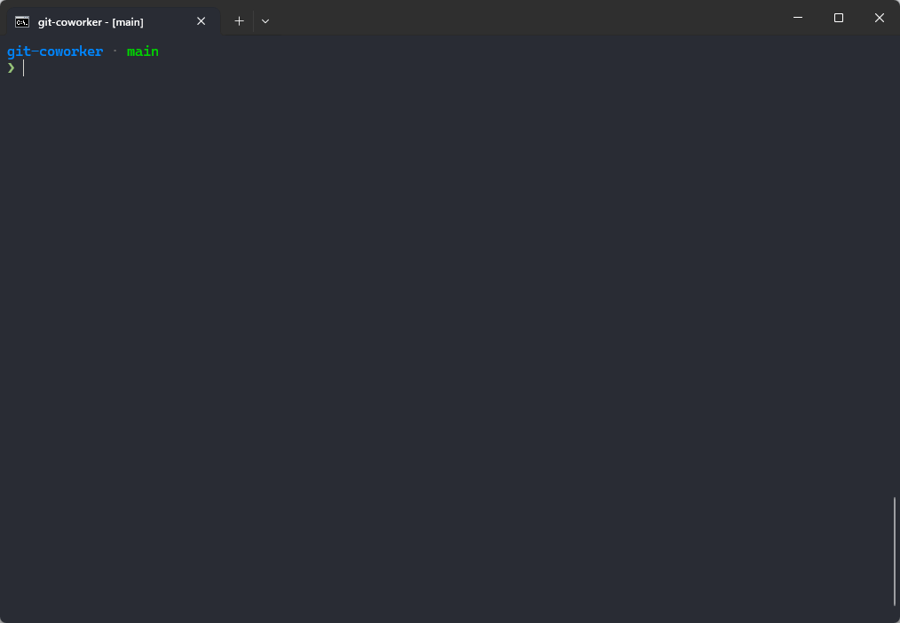

# Introduction

**git-loom** is a Git CLI tool that supercharges your workflow by weaving together multiple feature branches into a single integration branch. Inspired by tools like [jujutsu](https://github.com/martinvonz/jj) and [Git Butler](https://gitbutler.com/), git-loom helps you work on multiple features simultaneously while keeping your branches organized and independent.

Think of it as a loom that weaves multiple threads (feature branches) into a single fabric (integration branch).



## Core Concepts

### Integration Branch

An integration branch merges multiple feature branches together, allowing you to:

- Work on several features at once in a single branch
- Test how features interact with each other
- Keep feature branches independent and manageable
- See a clear relationship between your integration and feature branches

You create an integration branch with [`git loom init`](commands/init.md). It tracks a remote upstream (e.g. `origin/main`) and serves as the hub for all your feature work.

### Feature Branches

Feature branches are independent branches combined into the integration branch. You can manage them — reorder, amend, split — without leaving the integration context:

- Create feature branches with [`git loom branch`](commands/branch.md)
- Commit to them from the integration branch with [`git loom commit`](commands/commit.md)
- Move commits between branches with [`git loom fold`](commands/fold.md)
- Remove branches cleanly with [`git loom drop`](commands/drop.md)

### Weaving

When a feature branch is created inside the integration branch, git-loom automatically **weaves** it into the topology — restructuring the linear history into a merge-based layout where each feature branch appears as a side branch joined by a merge commit. This is what makes `git loom status` able to display the clear branch-aware graph.

### Short IDs

git-loom assigns compact, human-friendly identifiers to branches, commits, and files shown in `git loom status`. You can use these short IDs with any command instead of typing full hashes or branch names. What you see in the status output is what you type.

## Quick Start

```bash
# Start on your main branch
git checkout main

# Create an integration branch
git loom init

# Create feature branches
git loom branch feature-auth
git loom branch feature-ui

# Make changes and commit to a feature branch
git loom commit -b feature-auth -m "add login form" zz

# See the branch-aware status
git loom status

# Push a feature branch for review
git loom push feature-auth
```
